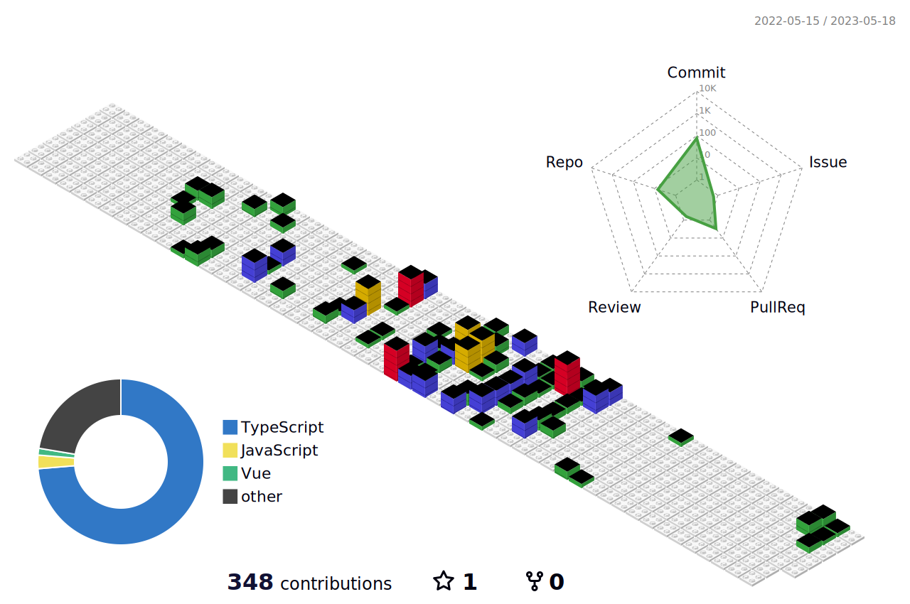

<h1 align="center"> Olá, eu sou Levi Eber! </h1>

🌱 Eu atualmente estou aprendendo Javascript e suas tecnologias. 
🧩 Pode me perguntar sobre Javascript e seu ecossistema, CSS e HTML.

## Principais tecnologias

